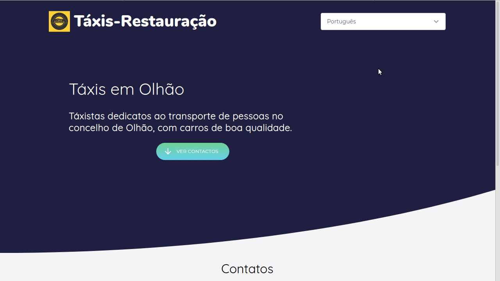

# restaxi-web

This repo is  the source code for the [taxisrestauracao.pt](https://taxisrestauracao.pt) webpage.

The website is just a simple page with the contact information for the Táxi driver.

## Features

* No external libraries (making it super light)
* Inline js and css (the hole website is in the .html)
* Multi-Languages (PT, EN and FR)

<p align="center">
  
</p>


## Running the procject

To start up the project in development mode just run ```npm start```. This will run webpack in watch mode. The files will be generated and saved in the ```dist``` folder.

To building for prod run ```npm run build```. This will generate the minified files and save them to ```dist```.


## Multi-Languages

I was able to have only one template and than using webpack generate a file for each language with the correct labels. This makes developing easiar beacause I don't have to maintain 3 equal files.

By default the website will load the portuguese version of the site, if the user wants to switch the languge he has to do it manually.


## Icons

[Free SVG icons for popular brands](https://github.com/simple-icons/simple-icons)

https://github.com/leungwensen/svg-icon
using metro ui css

